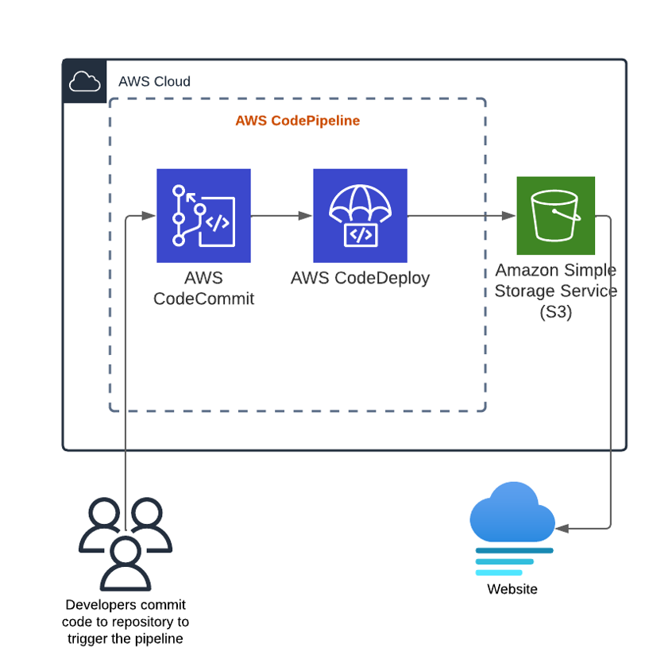

# CI-CD-with-AWS-pipeline

This project involves setting up a continuous deployment pipeline using AWS CodePipeline. The pipeline will be configured to deploy our web application to S3 continuously. To set up the pipeline, we will first ensure that we have the necessary prerequisites in place by configuring our source code repository using AWS CodeCommit and creating an S3 bucket for hosting static web applications. We will then proceed to create the continuous deployment pipeline using AWS CodePipeline and deploy our web application to S3.

- Create a CodeCommit Repository from the Management Console

- Add an index.html and JPG File to the Repository

- Create an S3 Bucket

- Enable Static Website Hosting

- Create an S3 Bucket Policy
Effect: Allow
Principal: *
AWS Service: Amazon S3
Actions: GetObject
Amazon Resource Name (ARN): <BUCKET_ARN_NUMBER>/*

- Create a Pipeline in AWS CodePipeline That Deploys a Static Website. On the Source page, set the following values:
Source provider: AWS CodeCommit
Click Skip build stage > Skip. In Deploy on the next page, select Amazon S3 as the deploy provider.

Technologies used in this project:

-	Cloud provider: AWS
-	AWS CodeBuild
-	AWS CodeDeploy
-	S3
